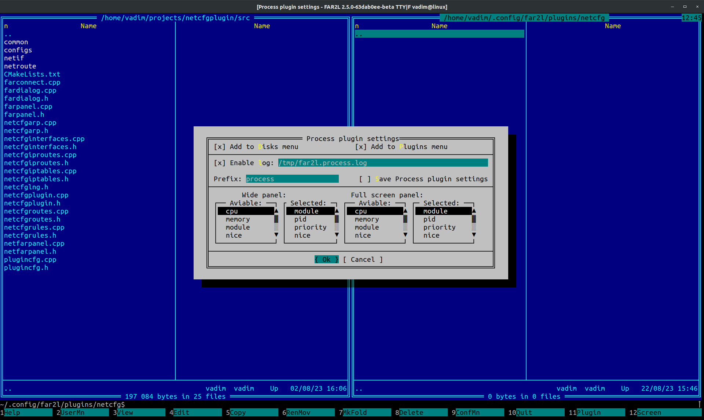
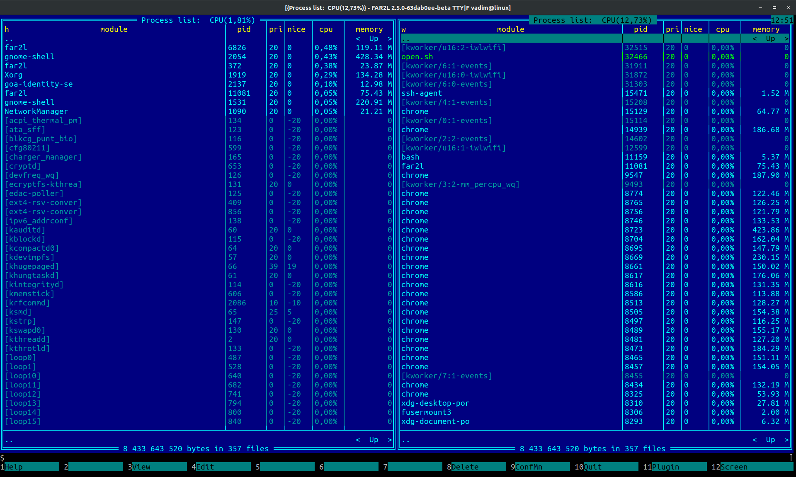
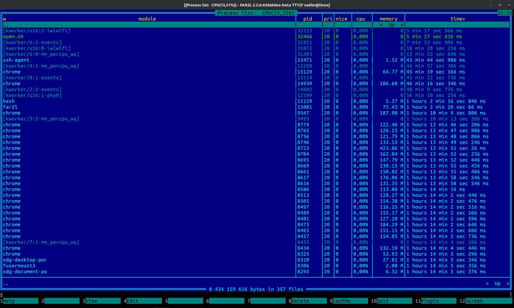
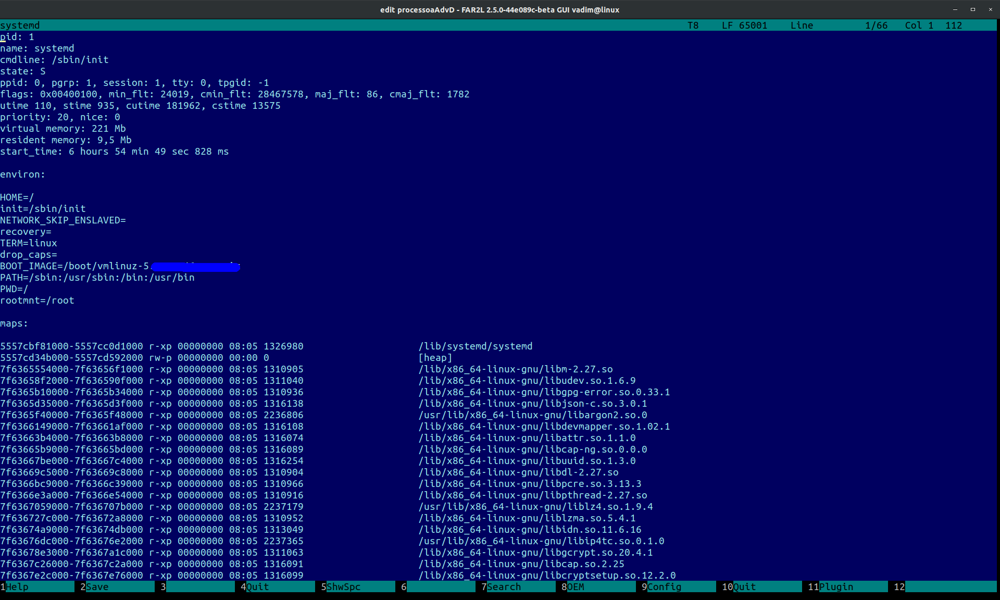
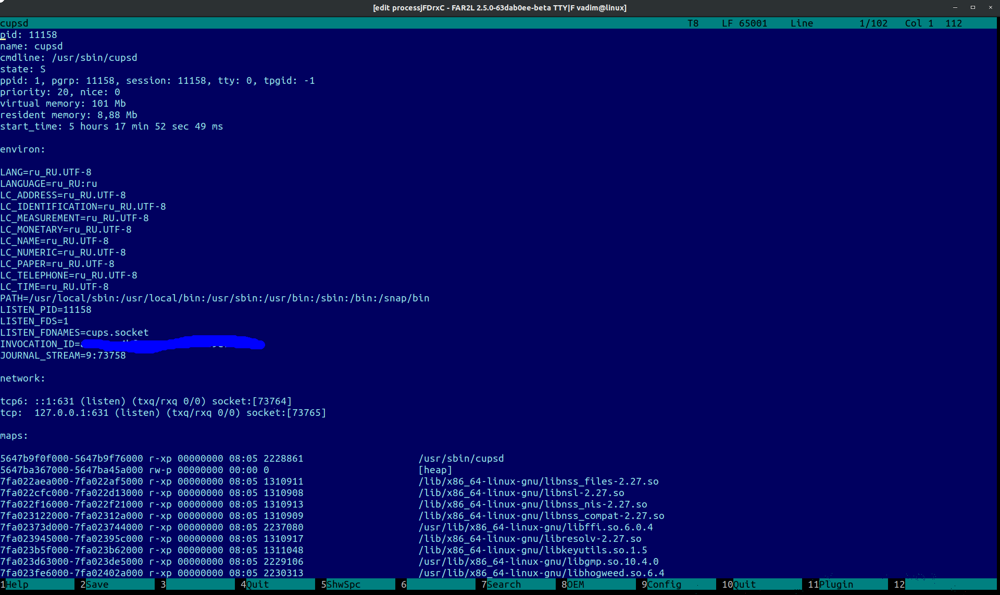
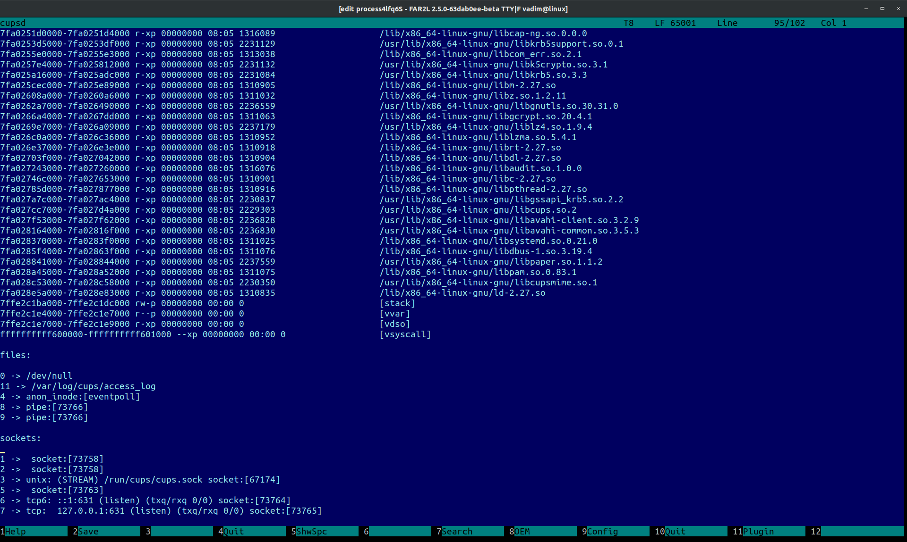
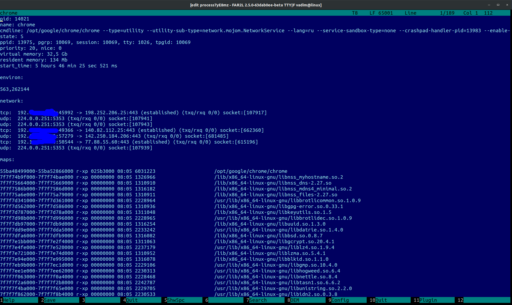

# processplugin

TODO:
Плагин только умеет выводить процессы, и удалять их. Нужно расширять.

Плагин позволяет (linux и macos):
 * просматривать, редактировать информацию о процессах

The plugin allows (linux and macos):
  * view and edit information about processes, ...

Build instruction like far2m (https://github.com/VPROFi/far2m)

If your want build inside other version far2m - put content ./src into ./far2m/processes and add to ./far2m/CMakeLists.txt add_subdirectory (processes)

